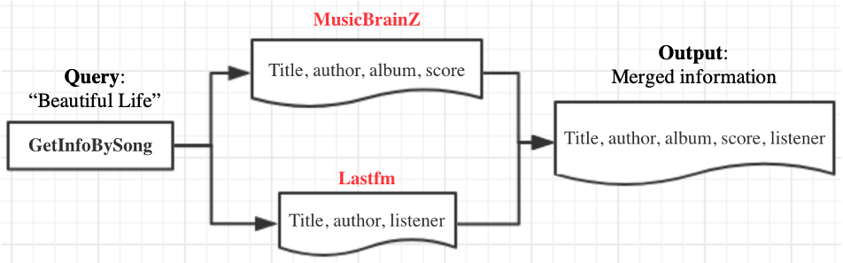
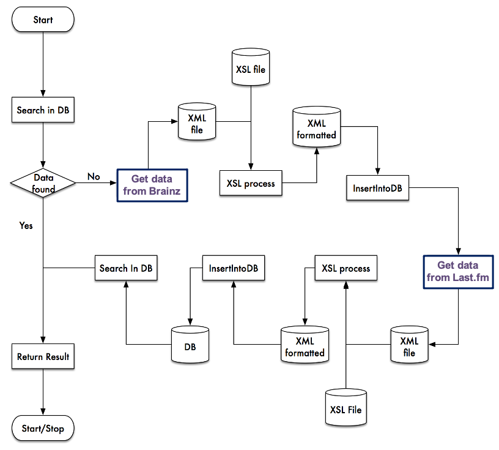
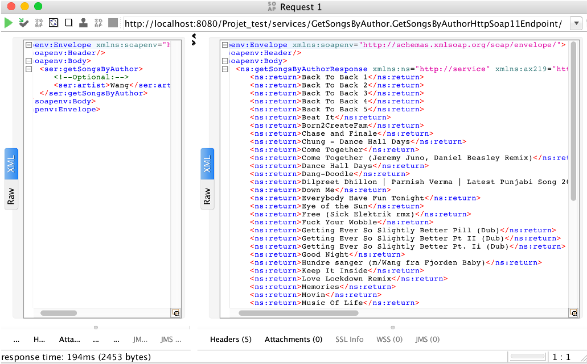
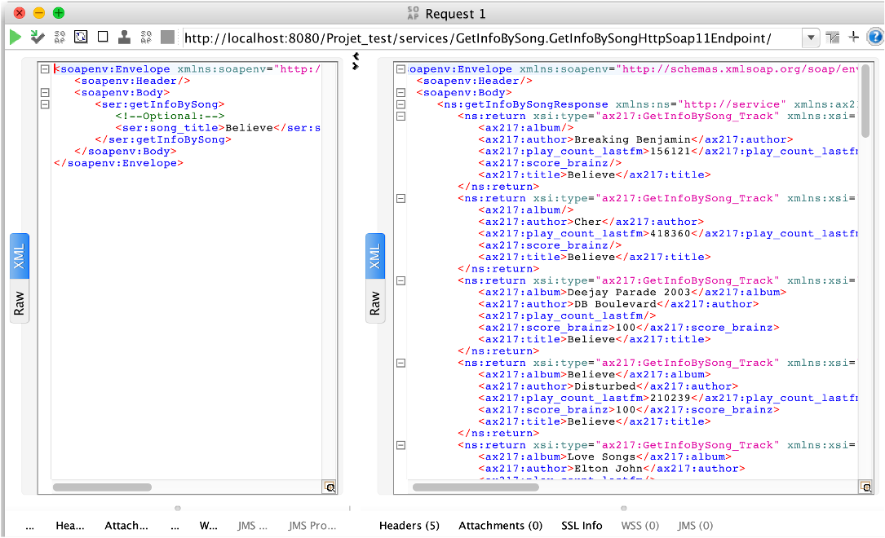
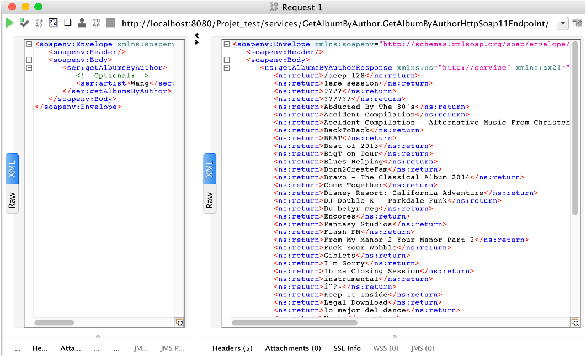

### Introduction

The goal of this project is to create an application (web service) that provides a client with **a uniform interface for accessing information **published by databases on the Internet.

The application integrates the data from two websites that publish similar information and use web services (SOAP or REST) to export their data. Here we adopt two music data sources:

- [MusicBrainz](https://musicbrainz.org/doc/MusicBrainz_API)
- [Last.fm](https://www.last.fm/api)

You can find a [project presentation here](./Presentation_Semi_structured_XML.pdf) (in French)

### Problem of the semi-structured data from different data sources

- The semi-structured XML data obtained from each data sources (e.g., music database APIs) are with different format
- The returned data with a uniform interface is required, which should be exposed as a web service for users

### Architecture design

The general Architecture of the system is presented in the following figure.

### Some technologies involved in the project 

- **Tomcat 7.0 + Axis2 (Web services) + JRE1.8**
- **Postman**: testing the REST request
- **XSLT + DOM/SAX**: transition and extraction of the semi-structured XML data from various sources
- **MySQL**: the database for stocking the desired data
- **SoapUI**: testing the generated Web Service

### Results Examples

- **GetSongsByAuthor**:

- GetInfoBySong

  

- GetAlbumByAuthor:

  

